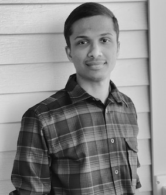

### <i class="bi bi-person-lines-fill"></i> About Me

I am a Research Assistant Professor in the [Department of Electrical
and Computer Engineering (ECpE)](https://www.ece.iastate.edu/), [Iowa
State University (ISU), USA](https://www.iastate.edu/), and affiliated
with the [Center for Wireless, Communities, and Innovation
(WiCI)](https://wici.iastate.edu). My work contributes primarily to
[**<u>ARA: Wireless Living Lab for Smart and Connected Rural
Communities</u>**](https://arawireless.org/) [Part of the [**NSF
Platforms for Advanced Wireless Research
(PAWR)**](https://advancedwireless.org/) program], under the
mentorship of
[**Prof.&nbsp;Hongwei&nbsp;Zhang**](https://www.ece.iastate.edu/~hongwei/).

Prior to joining ISU, I completed my Ph.D. at the [Indian Institute of
Space Science and Technology (IIST), India](https://www.iist.ac.in/),
in 2021 under the guidance of
[Prof.&nbsp;B.&nbsp;S.&nbsp;Manoj](https://www.iist.ac.in/people-faculty-profile/b-s-manoj). I
obtained my master's and bachelor's degrees from the [National
Institute of Technology, Calicut (NITC)](http://nitc.ac.in/) and
[Mahatma Gandhi University (MGU)](http://www.mguniversity.edu/),
India, respectively.

My research focuses on the design, development, and experimental
evaluation of next-generation distributed cyberinfrastructures
spanning cloud, edge, and wireless platforms.

---

### <i class="bi bi-newspaper"></i> Recent News

* [ Sep 2026 ] Our team has been awarded a
  **$5.08M NSF VINES Track 2 grant** for ==*AgSlicing: Predictable RAN
  and Spectrum Slicing for Precision Agriculture*.== I will serve as
  Co-Investigator on this three-year project led by Iowa State
  University, in collaboration with the University of Virginia,
  Skylark Wireless, and Federated Wireless.

* [ Sep 2026 ] IEEE Future Networks
   International Network Generation Roadmap (INGR) Satellite Working
   Group paper titled "[*Towards federated, green, and resilient 6G
   non-terrestrial networks*](https://arxiv.org/abs/2609.05184)," is
   now available in [</img>](https://arxiv.org/abs/2609.05184).

* [ Apr 2026 ] "==Demo: Experimental
  validation of limitations in TVWS spectrum sharing via the ARA
  wireless living lab,==" accepted in 2026 [**IEEE International
  Symposium on Dynamic Spectrum Access Networks (IEEE DySPAN
  '26),**](https://dyspan2026.ieee-dyspan.org/) May 2026, Washington,
  D.C., USA.

*  [ Mar 2026 ] Paper titled "[*Revisiting
   TVWS for rural broadband: Policy insights from nationwide
   availability analysis and ARA field
   validation,*](https://doi.org/10.1109/DySPAN69846.2026.11571151)"
   accepted for publication in Proceedings of the 2026 [**IEEE
   International Symposium on Dynamic Spectrum Access Networks (IEEE
   DySPAN '26),**](https://dyspan2026.ieee-dyspan.org/) May 2026,
   Washington, D.C., USA.

* [ Feb 2026 ] Paper titled "[*AraOptical
   testbed: Design, field trials, and channel analysis of long-range
   FSOC system with COTS
   transceivers*](https://doi.org/10.1109/JLT.2026.3667493)," accepted
   for publication in [**IEEE/Optica Journal of Lightwave Technology
   (IEEE
   JLT),**](https://ieeephotonics.org/publications/ieee-optica-journal-of-lightwave-technology/)
   February 2026.

* [ Jan 2026 ] Poster titled "[*Demonstration
   of a 4.2km MISO free-space optical communication link using COTS
   SFP+ transceivers*](https://doi.org/10.1117/12.3089075)," accepted
   in [**SPIE Photonics
   West,**](https://spie.org/conferences-and-exhibitions/photonics-west)
   San Francisco, CA, 17&ndash;22 January 2026.

